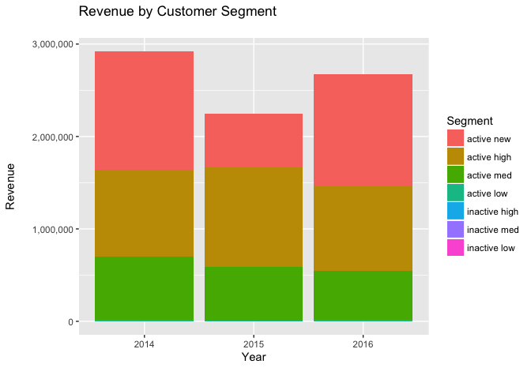

# Customer Segmentation and Valuation of Customer Data Base - US ONLY 
Steffen Hartleib  
2017-02-22  

### The Data Set

Online purchase data for a flash deal website from 2010 to 2017  
553,087 observations (line items), 19 variables

### Questions
1. Which customer segments are driving revenue? 
2. What is the value of the US customer data base?

***

### Let's look at year over year revenue and customer trends


```
## [1] TRUE
```

<!-- --><!-- --><!-- --><!-- --><!-- -->


=>  In 2016 the number of customers increased significantly. But Total Revenue rose only slightly. That's because customers placed fewer orders and spent less per order. This is pattern is typical for customer acquistion campaigns driven by discounts. The challenge will be to convert these new customers from bargain shoppers to valuable long term customers.
Let's segement the customers to see what's behind these trends.
&nbsp;


***

### Simple Customer Segmentation by Recency, Frequency and Monetary Value (RFM) 
We need to calculate three variables per customer:
1. Recency: Number of days since the last purchase  
2. Frequency:  Number of orders placed, life to date  
3. LTD Revenue: Product Revenue net of discounts life to date    
&nbsp;

#### Here are the summary statistics of each variable: 


|        |Recency |LTD.Revenue |No.of.Purchases |
|:-------|:-------|:-----------|:---------------|
|Minimum |0       |1           |1               |
|Mean    |949     |208         |3               |
|Median  |964     |60          |1               |
|Max     |2,292   |193,857     |1,378           |

&nbsp;

***

### Let's define our customer segements as follows. 
I'm using round numbers since this is a managerial analysis.
 
Segment        | Recency                | LTD Revenue  
-------------  | ---------------------  | -------------  
 Active New    | 1st purchase last year | 
 Active Low    | purchase last year     | < $100
 Active Med    | purchase last year     | >= $100 & < $1000
 Activ High    | purchase last year     | > $1000
 Inactive Low  | no purchase last year  | < $100
 Inactive Med  | no purchase last year  | >= $100 & < $1000
 Inactive High | no purchase last year  | > $1000

&nbsp;

***
   
### Summary of the segments:  


|Segment       |Customers | Perc_of_Tl_Cust|Rev_TD    |Rev_Last_Yr | Perc_of_Rev_Last_Yr|
|:-------------|:---------|---------------:|:---------|:-----------|-------------------:|
|active new    |15,935    |            0.23|1,215,187 |1,215,187   |                0.45|
|active high   |1,576     |            0.02|4,764,281 |911,875     |                0.34|
|active med    |4,032     |            0.06|1,661,047 |534,132     |                0.20|
|active low    |495       |            0.01|35,559    |14,696      |                0.01|
|inactive high |669       |            0.01|1,513,906 |0           |                0.00|
|inactive med  |14,726    |            0.21|3,693,935 |0           |                0.00|
|inactive low  |31,298    |            0.46|1,429,772 |0           |                0.00|


&nbsp;

***

### Here is how the customer segments changed over time:


<!-- -->

=> Active New customers more than doubled last year. Active High/Med/Low segments stayed almost flat. So customer acquisition efforts are paying off and customer retention is working. The challenge will be to retain these new active 
&nbsp;

***


### Here is how revenue per segment stacks up, over time:


<!-- -->

=> New Active customers drove the increase in revenue. 


 


# &nbsp;

***

## What's the value of the current data base? 
This isn't the same as Customer Life Time Value (LTV). LTV tells us how much a customer spends on average in her lifetime. That's very usefull to determine how much can we spend to acquire a new customer. Here we're asking how much more revenue can we expect from the customers in the data base. 


***

###  Let's create a Transition Matrix
It shows the probabilities of customers changing segments between 2015 and 2016, e.g. how what "Active High" customers in 2015 were also "Active High"" customers in 2016? etc. (the answer is 75%, not bad!)


|Var1          | active new| active high| active med| active low| inactive high| inactive med| inactive low|
|:-------------|----------:|-----------:|----------:|----------:|-------------:|------------:|------------:|
|active new    |          0|        0.02|       0.18|       0.04|          0.00|         0.23|         0.52|
|active high   |          0|        0.75|       0.00|       0.00|          0.25|         0.00|         0.00|
|active med    |          0|        0.06|       0.38|       0.00|          0.00|         0.56|         0.00|
|active low    |          0|        0.00|       0.20|       0.07|          0.00|         0.00|         0.73|
|inactive high |          0|        0.21|       0.00|       0.00|          0.79|         0.00|         0.00|
|inactive med  |          0|        0.00|       0.08|       0.00|          0.00|         0.92|         0.00|
|inactive low  |          0|        0.00|       0.02|       0.01|          0.00|         0.00|         0.98|

***
&nbsp;

### Let's quickly visualize where last year's New Active customers ended up this year:

<!-- -->


&nbsp;

***

### How do we forecast the size of each segment over the next 5 years?

Let's assume customers will continue to transition from segment to segment in the same proportions as from 2015 to 2016. That way we can mulitply this year's segments by the transition matrix to predict next year's segments. Then we'll multiply next year's (forecasted) segments by the same transition matrix to the get the following year. And so on.

&nbsp;


|              |  2016|  2017|  2018|  2019|  2020|  2021|  2022|  2023|  2024|  2025|  2026|
|:-------------|-----:|-----:|-----:|-----:|-----:|-----:|-----:|-----:|-----:|-----:|-----:|
|active new    | 15935|     0|     0|     0|     0|     0|     0|     0|     0|     0|     0|
|active high   |  1576|  1883|  1984|  2036|  2098|  2182|  2282|  2393|  2512|  2635|  2761|
|active med    |  4032|  6304|  4937|  4469|  4359|  4362|  4400|  4448|  4497|  4546|  4594|
|active low    |   495|   985|   462|   425|   418|   413|   408|   403|   398|   393|   388|
|inactive high |   669|   923|  1200|  1444|  1650|  1828|  1990|  2143|  2291|  2438|  2585|
|inactive med  | 14726| 19471| 21444| 22493| 23196| 23781| 24321| 24839| 25343| 25834| 26313|
|inactive low  | 31298| 39320| 39253| 38805| 38339| 37877| 37421| 36970| 36525| 36085| 35650|

***

### Now we can forecast revenue per segment for the next 5 years
(assuming that, on average, revenue per segment stays the same)


&nbsp;

***

<!-- -->

***

<!-- -->

***


<!-- -->

### Total net present value of the data base in 2026 is:

|Total Data Base |Per Customer |
|:---------------|:------------|
|11,814,504      |171.9        |


